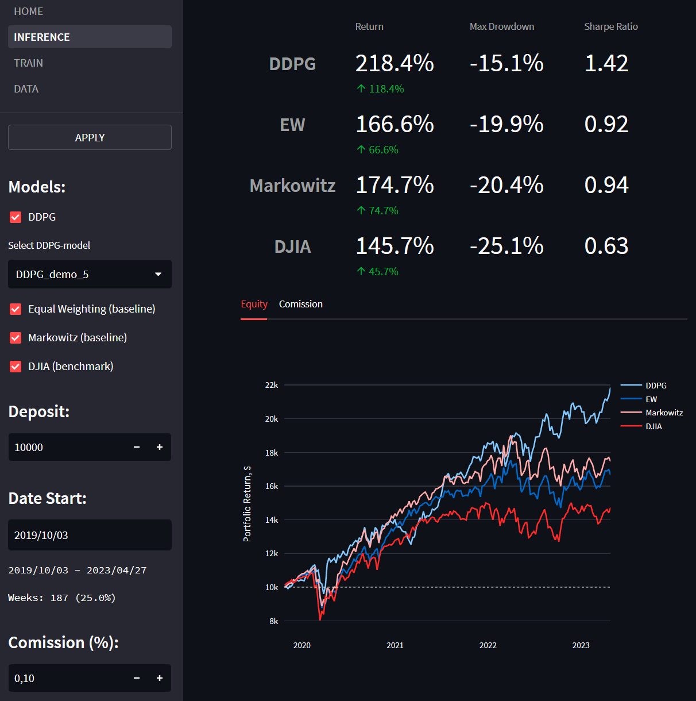

Клиент-серверное приложение для оптимизации инвестиционного портфеля
Связанный проект - https://github.com/KayumovRu/RL-invest-optimization


## Возможности:
* Просмот ценновых данных с возможностью обновления из облака bit.io
* Обучение и тестирование моделей
* Построение графиков и метрик по результатам тестирования и обучения
* Сохранение моделей
* Авторизация с двумя уровнями доступа
 


## Поддерживаемые модели:
* DDPG - DRL-модель, которая сравнивается с остальными
* EW - равнодолевая модель (baseline)
* Markowitz - модель Марковица (baseline)
* DJIA - фондовый индекс (benchmark)

## Сервис представлен 4 страницами:
* HOME – общие сведения, авторизация и дебаг-информация (для администратора).
* INFERENCE – применение одной из сохраненных моделей DDPG и сравнение с базовыми моделями и бенчмарками.
* TRAIN – обучение DDPG-моделей и их сохранение.
* DATA – просмотр истории по активам и их обновление из облака (доступно для администратора)

## Основные компоненты приложения:
* Хранение данных: PostgresSQL в облаке bit.io и файловая система сервера.
* Обработка запросов к бэкенду через FastAPI.
* Фронтенд для визуализации и формирования пользовательского интерфейса: Streamlit.
* Фреймворк глубокого обучения: PyTorch.
* Ключевые пакеты: Plotly, Requests, Pandas, Threading.

## Файловая структура:
* /CORE - функции и классы по моделям и среде
* /DATASETS - датасеты (администратор может обновлять в интефейсе из облака)
* /FASTAPI - бэкенд на основе FastAPI, здесь крутится обучение и тестирование моделей
* /FRONTEND - фронтенд на основе Streamlit, здесь пользовательский интерфейс
* /MODELS - здесь сохраняются модели

## Основан на источниках:
* [«A Deep Reinforcement Learning Framework for the Financial Portfolio Management Problem»](https://arxiv.org/abs/1706.10059) (формулы реализации модели DDPG)
* [Amazon Sagemaker](https://github.com/Fundator/amazon-sagemaker-examples/tree/0dacdccdb3bf66339d4f1b1854c8d151ee8c5840) (некоторые технические приемы имплментации модели)


## ====== Как запустить

upd: пока смотрите ручной способ ниже, docker файлы не обновлены

```
docker-compose build
docker-compose up
```

Перейти на http://localhost:8501
Вбить депозит, нажать Optimize


## ====== Для запуска вручную

**FASTAPI (бэкенд)**

После загрузки создать файл, добавить в него:

```
[passwords]
demo = "demo"
admin = "12345"
```

В одном терминале переходим в папку 
~/portfolio_optimize/fastapi$

и выполняем команду

```
python3 -m uvicorn main:app --reload

```


**STREAMLIT (фронтенд)**

В другом терминале заходим в
~/portfolio_optimize/frontend$

и выполняем

```
 streamlit run app.py
```

переходим по ссылке

http://localhost:8501


## ====== Рекомендуемый сценарий использования для ознакомления

* Вбить для доступа на HOME: demo demo
* На DATA посмотреть ценовые данные по активам
* На INFERENCE выбрать любые модели для тестирования
* НА TRAIN настроить и обучить модель, попробовать сохранить ее, вернуться на INFERENCE, протестировать
* Выйти на HOME и авторизоваться от admin, попробовать на DATA нажать UPDATE, обновив данные из облака

## ====== Дополнительный сведения

Распространяется по лицензии Apache License 2.0 