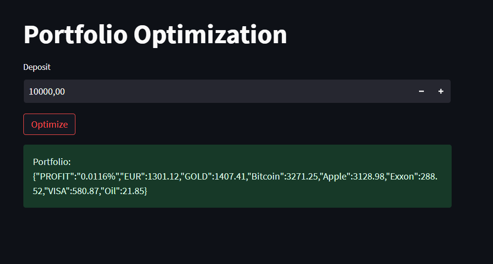

Сервис по дипломному проекту - https://github.com/KayumovRu/RL-invest-optimization

- Серверная часть на FastAPI
- Фрондент на Streamlit

Что делает сервис на данный момент:
- по предобученной модели определяет, на какую сумму надо купить активы портфеля
- пользователь передает через поле размер депозита



(сервис улучшается)

## ====== Как запустить

```
docker-compose build
docker-compose up
```

Перейти на http://localhost:8501
Вбить депозит, нажать Optimize


## ====== Для запуска вручную

**FASTAPI (бэкенд)**

В одном терминале переходим в папку 
~/portfolio_optimize/fastapi$

и выполняем команду

```
python3 -m uvicorn main:app --reload

```


**STREAMLIT (фронтенд)**

В другом терминале заходим в
~/portfolio_optimize/frontend$

и выполняем

```
 streamlit run app.py
```

переходим по ссылке

http://localhost:8501

Вбиваем в поле размер депозита и нажимаем Optimize